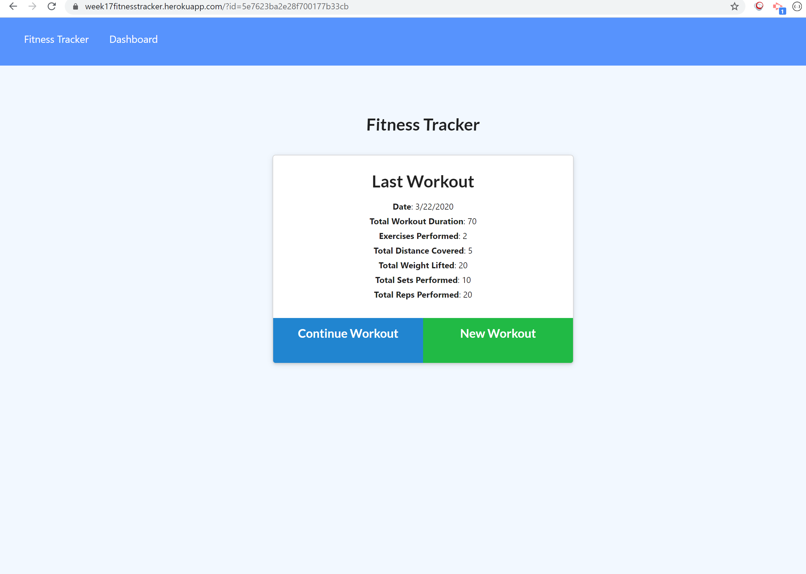
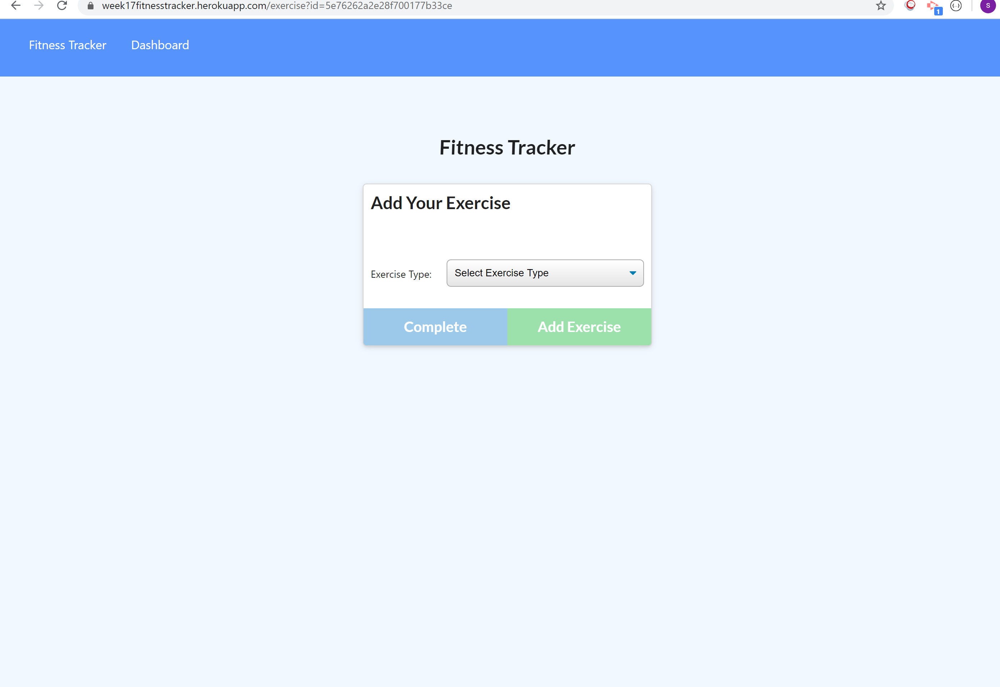
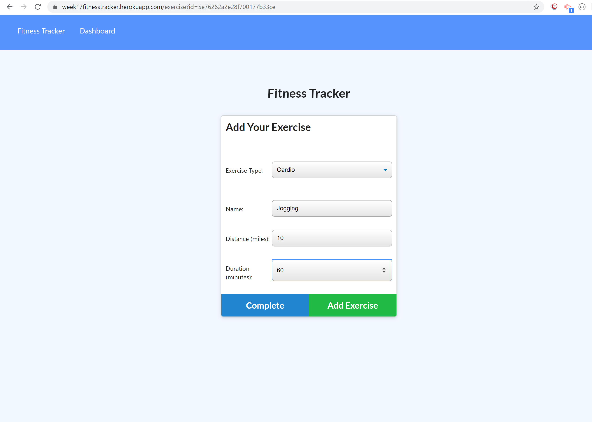
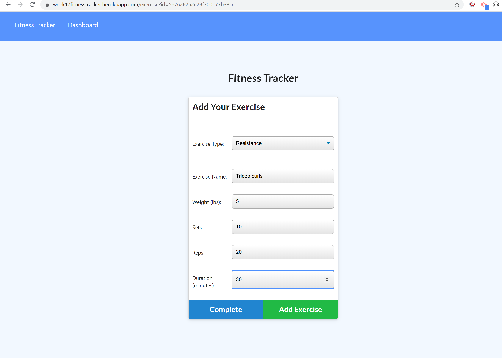
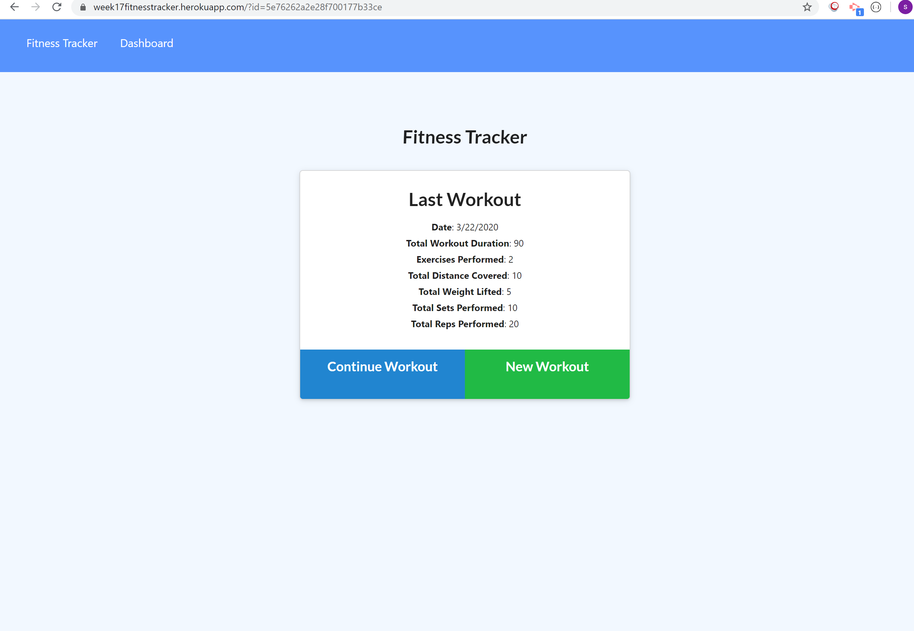
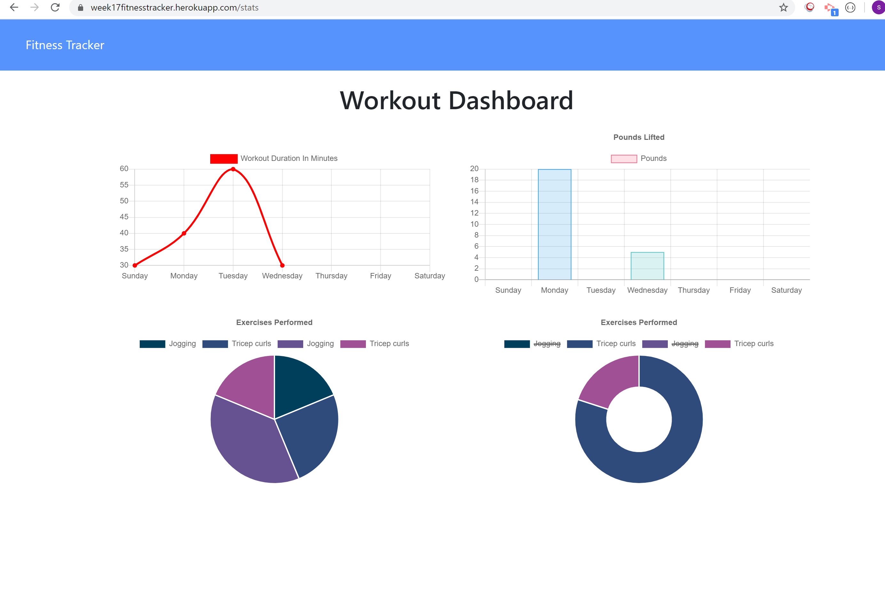

# Unit 17 Nosql Homework: Fitness Workout Tracker

+ Github link: https://github.com/sevenspell/week17-assignment
+ Heroku app link: https://week17fitnesstracker.herokuapp.com/

## Description 

This project is to create a fitness tracker app that allows users to create new workouts, and add in as many exercises as they want into a workout. It records the type of exercise, the duration of it, and the other metrics such as distance if it's a cardio type of exercise, or number of reps, sets, weight of weights used etc. Users can also choose to add on exercises to the last workout, or create an entirely new workout. The latest summation of the metrics of the last workout will then be shown on the homepage for users to keep track. 

There is also a dashboard that shows the metrics in pie charts and graphs. This allows users to have a good overall view of their workouts.

## Applications Used
+ MongoDB / Mongoose
+ Express

## Usage 

1. Go to Heroku app link: https://week17fitnesstracker.herokuapp.com/. You will see the aggregated exercise data from the last workout.

2. Click on 'New Workout' to create a new workout. It will bring you to the exercise page.

3. Select exercise type. Fill in the fields and click on 'Add Exercise'.

4. Select the other exercise type. Fill in the fields and click on 'Add Exercise'. Click on 'Complete' when you don't have any more exercises to add.

5. It will bring you to the homepage and it will show the aggregated numbers of the exercises in the last workout you created.

6. Click on 'Dashboard' to see graphs and pie charts of your workout data.

